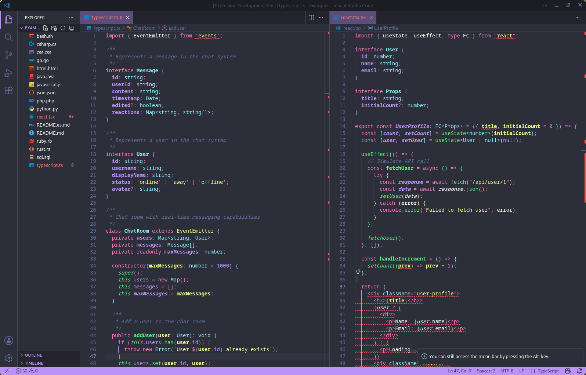
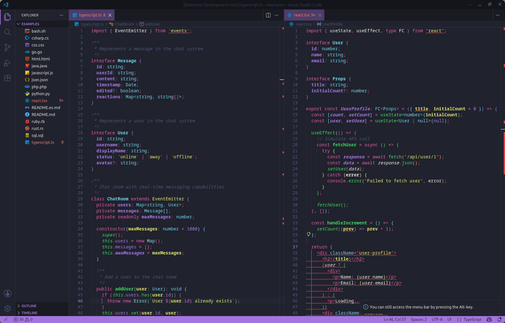
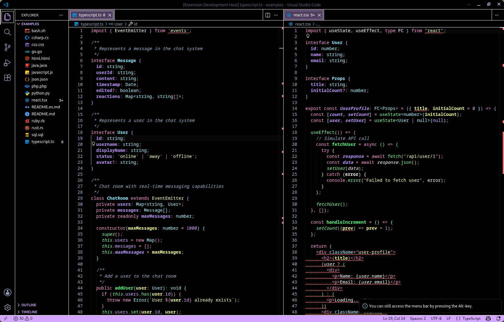

  
  <h1>Neomono</h1>
  

    <b>A vibrant, futuristic dark theme with neon accents for modern developers.</b>
  

  <!-- BADGES_START -->
  

    
    
    
  

  <!-- BADGES_END -->

---

## ✨ Preview

| Neomono | Neomono Deep | Neomono HC |
|:---:|:---:|:---:|
|  |  |  |

## 📦 Installation

1. Install **Neomono** from the VS Code Marketplace or Open VSX.
2. Select a variant: `Ctrl+K` `Ctrl+T` → **Neomono**, **Neomono Deep** or **Neomono HC**.

| Variant | Description |
| --- | --- |
| **Neomono** | Main dark theme with neon purple accents. |
| **Neomono Deep** | Deeper blacks, slightly muted palette. |
| **Neomono HC** | High-contrast variant for accessibility. |

## 🐞 Reporting bugs

Open a [GitHub issue](https://github.com/Monosen/Neomono/issues) and include a screenshot of the problem and the language/file type affected.

## 📄 License

MIT — see [LICENSE](LICENSE).

---

  Made with ❤️ by <a href="https://github.com/Monosen">Monosen</a>

