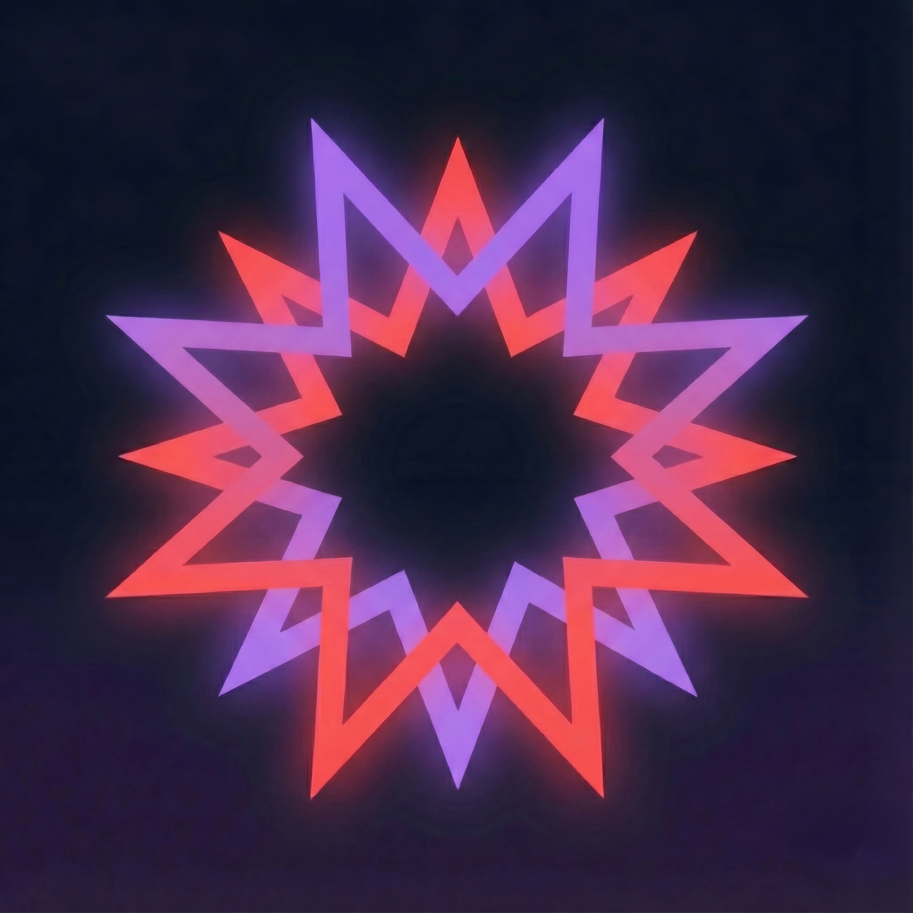

  
  <h1>Neomono</h1>
  

    <b>A vibrant, futuristic dark theme with neon accents for modern developers.</b>
  

  <!-- BADGES_START -->
  

    
    
    
    
  

  <!-- BADGES_END -->

  

    <a href="README.md">English</a> • <a href="README.es.md">Español</a>
  

---

## 📦 Installation & Usage

1.  Install **Neomono** from the VS Code Marketplace.
2.  Select the theme: `Ctrl+K` `Ctrl+T` > **Neomono**.

## ✨ Neon Dreams Effect

Enable the glow effect for a full cyberpunk experience.

1.  Install **[Custom CSS and JS Loader](https://marketplace.visualstudio.com/items?itemName=be5invis.vscode-custom-css)**.
2.  Run command **`Neomono: Enable Neon Dreams`** (or **`Neomono: Toggle Neon Dreams`**).
3.  Restart VS Code if prompted.

> [!NOTE]
> You may see an `[Unsupported]` warning in VS Code. This is normal and safe.
> To hide it, add `"window.titleBarStyle": "custom"` to your settings.

### Commands

| Command | Description |
| --- | --- |
| `Neomono: Enable Neon Dreams` | Register the glow stylesheet and reload Custom CSS. |
| `Neomono: Disable Neon Dreams` | Unregister the glow stylesheet and reload Custom CSS. |
| `Neomono: Toggle Neon Dreams` | Enable or disable depending on the current state. |

### Settings

| Setting | Default | Description |
| --- | --- | --- |
| `neomono.neonDreams.autoReload` | `true` | Automatically reload Custom CSS after enabling or disabling the effect. |
| `neomono.neonDreams.showNotifications` | `true` | Show informational notifications when the state changes. |

## 📄 License

MIT License - see [LICENSE](LICENSE).

---

  Made with ❤️ by <a href="https://github.com/Monosen">Monosen</a>

